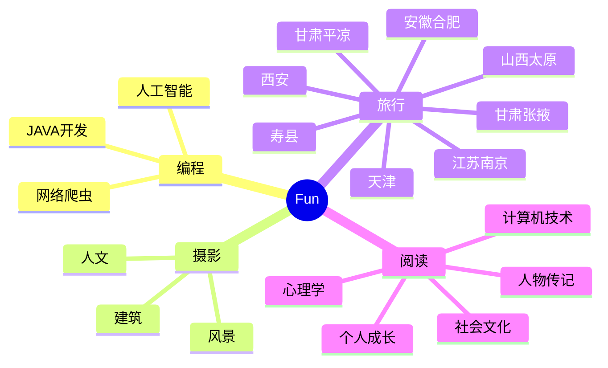

<div align="center">
  
  <!-- dynamic typing effect 动态打字效果 -->
  <div align="center">
    <a href="https://blog.funvip.live"></a>
  </div>

  <!-- knock code pictures 敲代码的图片 -->
  <br>

  <!-- profile logo 个人资料徽标 -->
  <div align="center">
    <a href="https://geekswg.js.cool/"></a>&emsp;
    <a href="https://twitter.com/geekswg/"></a>&emsp;
    <a href="https://www.youtube.com/@geekswg"></a>&emsp;
    <a href="https://box.sunguoqi.com/weixin_mp"></a>&emsp;
    <a href="https://space.bilibili.com/39865904/"></a>&emsp;
    <a href="https://blog.csdn.net/geekswg/"></a>&emsp;
    <a href="https://www.zhihu.com/people/geekswg/"></a>&emsp;
    <!-- visitor statistics logo 访客数统计徽标 -->
    
  </div>

  <!-- Snake Code Contribution Map 贪吃蛇代码贡献图 -->
<picture>
  <source media="(prefers-color-scheme: dark)" srcset="https://cdn.jsdelivr.net/gh/shiqustudio/shiqustudio/profile-snake-contrib/github-contribution-grid-snake-dark.svg" />
  <source media="(prefers-color-scheme: light)" srcset="https://cdn.jsdelivr.net/gh/shiqustudio/shiqustudio/profile-snake-contrib/github-contribution-grid-snake.svg" />
  
</picture>

</div>

#  🙋 Hello

<table style="display: inline-table;width: 100%;max-width: 100%;overflow: auto;">

<tr><td>

<!-- 近期博客 -->
### 📃 Recent Blog
  


<!-- START_SECTION:blog -->
* <a href='https://shiqustudio.github.io/posts/%E7%BE%8A%E6%AF%9B%E8%96%85/' target='_blank'>羊毛·薅</a> - Sat, 29 Jul 2023 17:27:11 +0000
* <a href='https://shiqustudio.github.io/tools/%E7%BD%91%E7%BB%9C%E5%B7%A5%E5%85%B7/' target='_blank'>网络工具</a> - 
* <a href='https://shiqustudio.github.io/posts/%E6%90%9C%E7%B4%A2%E5%BC%95%E6%93%8E/' target='_blank'>搜索引擎</a> - Fri, 07 Jul 2023 17:27:11 +0000
* <a href='https://shiqustudio.github.io/personal/%E6%8F%90%E9%97%AE%E7%9A%84%E6%99%BA%E6%85%A7/' target='_blank'>如何提问：提问的智慧</a> - 
* <a href='https://shiqustudio.github.io/tools/%E4%B9%A6%E7%AD%BE/' target='_blank'>书签工具</a> - Sat, 01 Jul 2023 17:27:11 +0000
<!-- END_SECTION:blog -->

</td></tr>

<tr><td>

### 🤾‍♂️ Funny Soul


<!-- START_SECTION:douban -->
* <a href='http://movie.douban.com/subject/35525475/' target='_blank'>在看公诉</a> 🌟🌟🌟☆☆ 还行- 2023-06-09
* <a href='http://movie.douban.com/subject/35597507/' target='_blank'>在看白色城堡</a> 🌟🌟🌟🌟☆ 推荐- 2023-06-09
* <a href='http://movie.douban.com/subject/35555996/' target='_blank'>在看平凡之路</a> 🌟🌟🌟🌟🌟 力荐- 2023-05-08
* <a href='http://movie.douban.com/subject/35766491/' target='_blank'>看过满江红</a> 🌟🌟🌟🌟🌟 力荐- 2023-05-01
* <a href='http://movie.douban.com/subject/35622198/' target='_blank'>想看法言人</a> - 2023-04-25
<!-- END_SECTION:douban -->

</td></tr>

<tr><td>

<!-- wakatime 统计 -->
### 📊 WakaTime

<picture>
  <source
    srcset="https://github-readme-stats.vercel.app/api/wakatime?username=geekswg&layout=compact&text_color=f0f6fc&bg_color=00000000&hide_border=true&hide_title=true"
    media="(prefers-color-scheme: dark)"
  />
  <source
    srcset="https://github-readme-stats.vercel.app/api/wakatime?username=geekswg&layout=compact&text_color=1f2328&bg_color=00000000&hide_border=true&hide_title=true"
    media="(prefers-color-scheme: light), (prefers-color-scheme: no-preference)"
  />
  
</picture>

</td></tr>

<tr><td>

<!--START_SECTION:waka-->
**I'm a Night 🦉** 

```text
🌞 Morning                361 commits         ███░░░░░░░░░░░░░░░░░░░░░░   13.74 % 
🌆 Daytime                675 commits         ██████░░░░░░░░░░░░░░░░░░░   25.69 % 
🌃 Evening                940 commits         █████████░░░░░░░░░░░░░░░░   35.78 % 
🌙 Night                  651 commits         ██████░░░░░░░░░░░░░░░░░░░   24.78 % 
```
📅 **I'm Most Productive on Tuesday** 

```text
Monday                   466 commits         ████░░░░░░░░░░░░░░░░░░░░░   17.74 % 
Tuesday                  496 commits         █████░░░░░░░░░░░░░░░░░░░░   18.88 % 
Wednesday                372 commits         ████░░░░░░░░░░░░░░░░░░░░░   14.16 % 
Thursday                 280 commits         ███░░░░░░░░░░░░░░░░░░░░░░   10.66 % 
Friday                   278 commits         ███░░░░░░░░░░░░░░░░░░░░░░   10.58 % 
Saturday                 348 commits         ███░░░░░░░░░░░░░░░░░░░░░░   13.25 % 
Sunday                   387 commits         ████░░░░░░░░░░░░░░░░░░░░░   14.73 % 
```


📊 **This Week I Spent My Time On** 

```text
🕑︎ Time Zone: Asia/Shanghai

💬 Programming Languages: 
YAML                     3 hrs 35 mins       ██████████████░░░░░░░░░░░   57.25 % 
Markdown                 1 hr 47 mins        ███████░░░░░░░░░░░░░░░░░░   28.58 % 
CSS                      38 mins             ███░░░░░░░░░░░░░░░░░░░░░░   10.12 % 
SCSS                     7 mins              ░░░░░░░░░░░░░░░░░░░░░░░░░   01.92 % 
Pug                      4 mins              ░░░░░░░░░░░░░░░░░░░░░░░░░   01.13 % 

🔥 Editors: 
VS Code                  6 hrs 17 mins       █████████████████████████   100.00 % 

💻 Operating System: 
Windows                  6 hrs 17 mins       █████████████████████████   100.00 % 
```


 Last Updated on 31/07/2023 00:54:04 UTC
<!--END_SECTION:waka-->
  
</td></tr>
</table>

<!-- ########################################## 分割 ########################################## -->


<div align="center" >



<!-- just img 图片 -->


<!--  skill badge 技能徽章 -->
💪 正在学习


  
🧠 计划学习


🧰 常用的工具


<!-- programming tool icon 编程工具图标 -->
<br>

<!-- svg -->


 


<br>

<!-- gif -->


<!-- just img 图片 -->
</div>


</div>


<!-- just img 图片 -->

</div>
